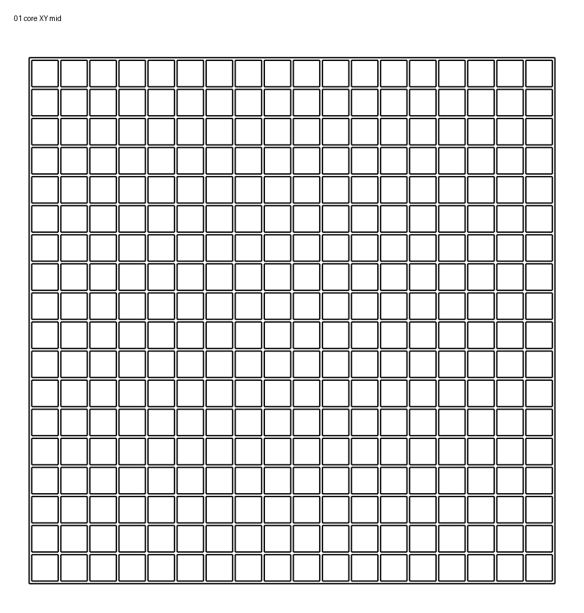
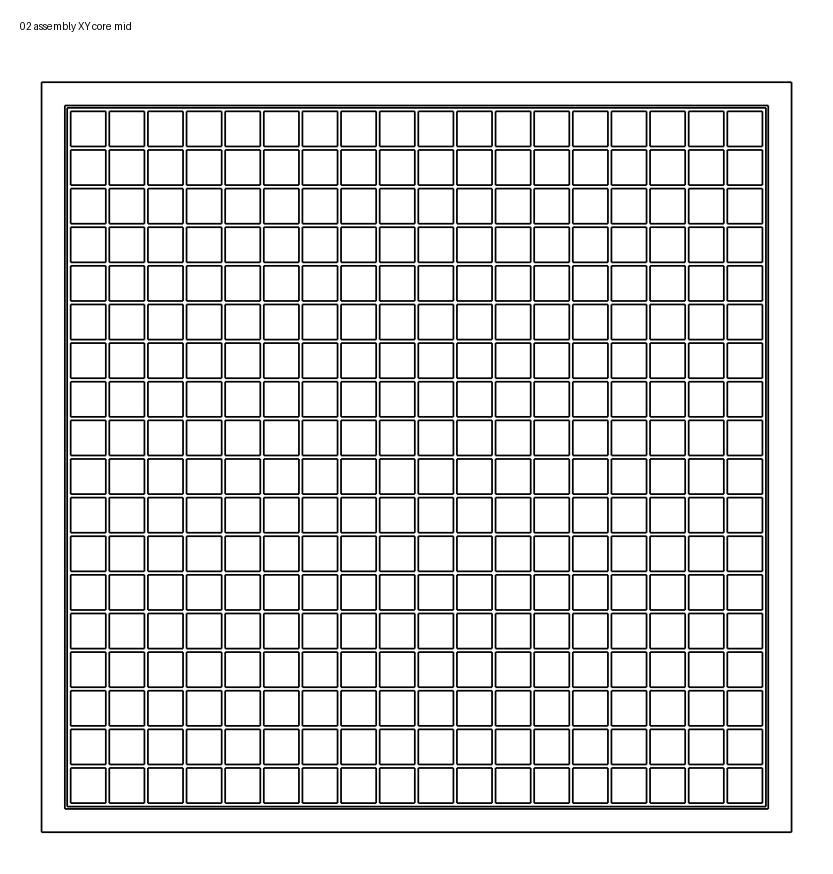
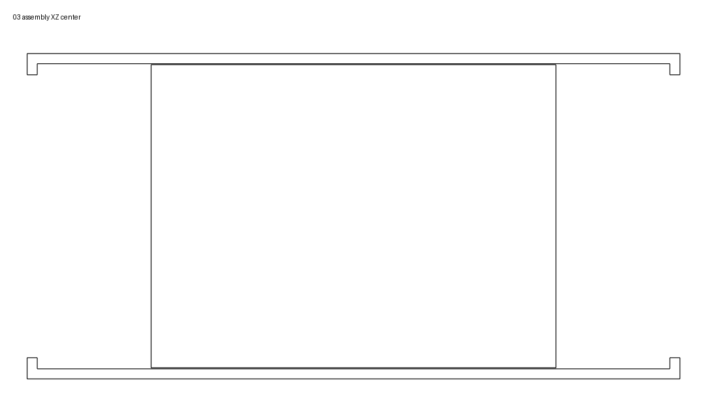
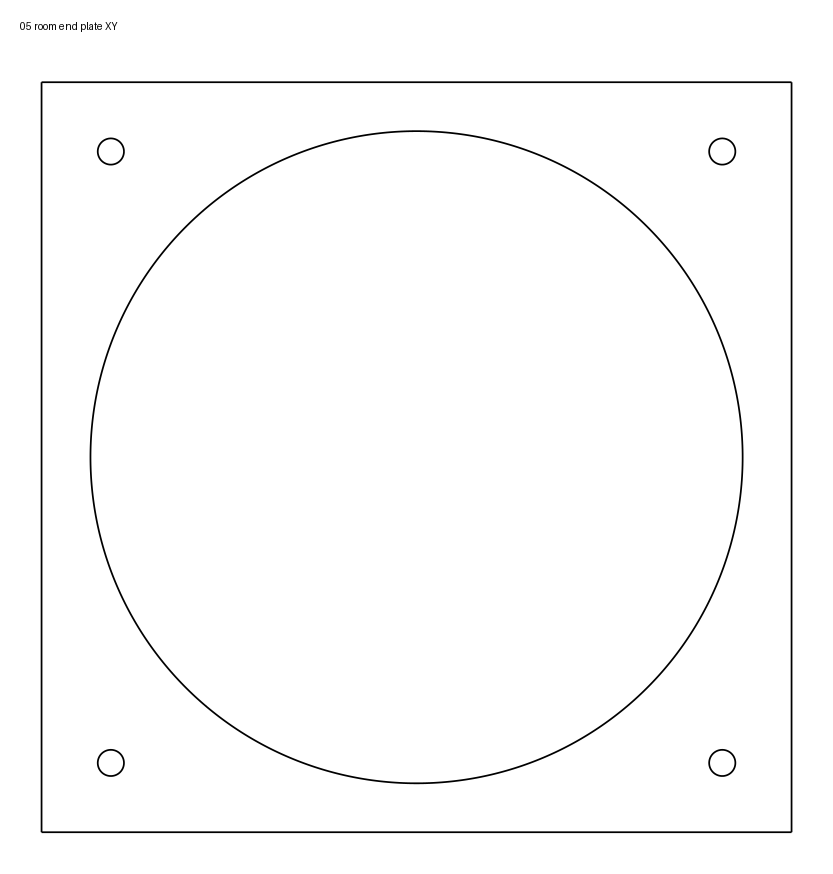

# HX-V1 CAD section review

This review was generated from the current `cad/hx-v1` CadQuery geometry and orthographic section views.

## Geometry checked

- regenerative core: 120 × 120 × 160 mm
- module shell: 128.8 × 128.8 × 258 mm
- passage: 120.8 × 120.8 mm
- core clearance: 0.4 mm per side
- fan opening: Ø112 mm
- 120 mm fan hole spacing: 105 mm
- core open area: 11,793.96 mm²
- fan-plate aperture area: 9,852.03 mm²

CadQuery/OCC reports both core and shell as valid solids. In the nominal assembled position the core does not intersect the shell.

## Section images

### Core transverse section

The 18 × 18 straight-channel matrix is regular and symmetric. No missing or closed channels are visible in this section.

### Core inside shell

The core fits in the passage, but the design currently provides only nominal clearance and no sealing or retention feature.

### Longitudinal center sections

The core is positioned between two 45 mm plenums. The current shell has no axial stops, gasket lands, cartridge lock, drain geometry or service opening.

### End plate

The opposite end is geometrically identical.

## Findings

### BLOCKER — removable core cannot be inserted into the current one-piece shell

The core is 120 × 120 mm. Both integral end plates have only a Ø112 mm circular opening. Therefore the square core cannot pass through either end plate.

This contradicts the current `removable_core: true` design setting. HX-V1 must be split into serviceable parts, or receive a side/top service opening, before the core can actually be installed or replaced.

### HIGH — no core retention or gasket seal

The shell passage is 120.8 mm for a 120 mm core, i.e. only 0.4 mm nominal clearance per side. There is:

- no axial stop,
- no cartridge latch,
- no gasket groove,
- no compressible seal,
- no tolerance strategy for FDM shrinkage/warping.

The core can slide axially in the model and a real printed core may bind despite the nominal clearance. A serviceable cassette with controlled clearance plus gasket land is required.

### HIGH — inactive axial fan remains in the active airflow path

The current opposed-fan baseline puts one fan at each end of the same straight duct. During each pendulum phase the stopped fan remains in the air path.

This can add a large and currently unknown pressure loss and may cause windmilling. This is already identified as a measurement item, but it remains a major architectural risk until tested. A branched path with passive/servo dampers is the fallback.

### HIGH — condensate has no defined path

The current regenerative matrix consists of straight square channels and the shell has no drain, slope or condensate collector.

If the installed airflow axis is horizontal, water can remain on channel floors. That is undesirable for hygiene and creates a frost risk. The next revision needs an installation orientation, drain direction and either channel/shell slope or a dedicated condensate collection geometry.

### MEDIUM — abrupt circular-to-square expansion

The fan opening is Ø112 mm (9,852 mm²), while the core has 11,794 mm² open flow area. The fan aperture is therefore about 16.5% smaller than the matrix open area.

A 45 mm plenum provides some redistribution, but the section shows no diffuser, guide geometry or flow straightener. The square core corners may see lower velocity than the center. This should be checked with an anemometer grid or simple CFD later.

### MEDIUM — outer cartridge wall is only the matrix wall thickness

The core perimeter is formed by the same 0.6 mm walls as the internal grid. For a removable 120 × 120 × 160 mm cartridge this is mechanically fragile at the edges and offers no robust sealing surface.

A thicker perimeter frame around the matrix is recommended while keeping the internal heat-transfer walls thin.

### MEDIUM — one-piece shell is not a practical print/service strategy

The current shell envelope is 258 mm long before real fan bodies, filters and mounting features. A one-piece print therefore needs at least a 258 mm usable printer axis.

In addition, the integral end plate at the far end creates difficult unsupported regions depending on print orientation. A split shell is preferable for printability, core installation, cleaning and later gasket replacement.

### CHECK — exact P12 Pro PST mechanical interface still needs confirmation

The model currently assumes a 120 mm fan, 105 mm hole spacing, 4.5 mm mounting holes and Ø112 mm airflow opening. These values are plausible but must be checked against the actual P12 Pro PST hardware before freezing the fan plate.

## What is not an error

- The matrix section is regular and open.
- The core and shell solids are valid BRep objects.
- The nominal core does not collide with the shell.
- Opposed fixed-direction fans can create pendulum flow in principle; the unresolved question is the pressure loss of the inactive fan, not the direction logic itself.

## Required HX-V1.1 changes

1. split/serviceable housing or side-access cassette door,
2. cartridge stops and retention,
3. gasket/sealing lands with realistic FDM clearance,
4. thicker core perimeter frame,
5. condensate drain/slope strategy,
6. printable housing segmentation,
7. exact P12 fan interface validation,
8. keep axial-opposed version as a benchmark but create a branched/damper comparison variant,
9. add section-view generation to CAD CI so future revisions can be reviewed visually.
